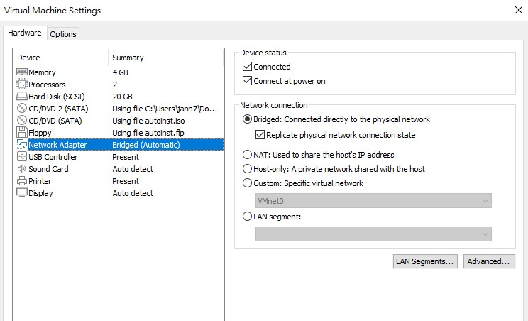

# opensips and http interface 

使用版本opensips 3.3

以 debian/bullseye docker 架設在 ubuntu18 的 vm上

## settings

須將vm 網路設定為 bridged ，否則區域網路內的裝置無法連接sips， 並勾選 replicate physical network
(使用此網路設定若vm太久沒用不知為何導致 -> a start job is running for wait for network.........)

使用HOST-only 無法連接dns

目前使用NAT

set host_ip in .env by command below

    <!-- ip route get 8.8.8.8 | head -n +1 | tr -s " " | cut -d " " -f 7 -->

    echo HOST_IP=$(ip route get 8.8.8.8 | head -n +1 | tr -s ' ' | cut -d ' ' -f 7) > .env

## Build and run the image

run with output

    docker-compose up --build

run in the background

    docker-compose up --build -d

